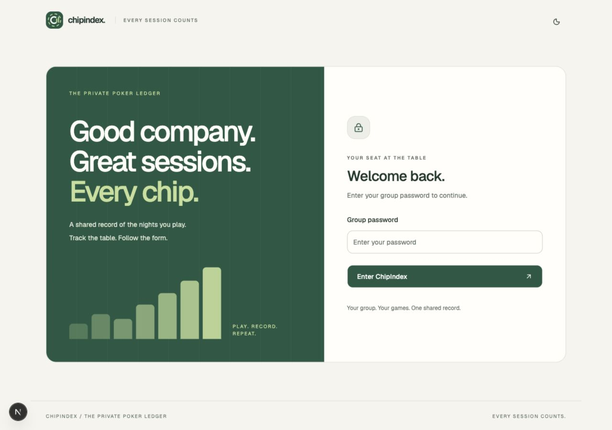

# ChipIndex visual identity

ChipIndex is the private poker ledger: a shared record of sessions and player performance. The identity pairs the warmth of a familiar table with the precision of a ledger. The brand line is **Every session counts.** Product copy stays in English, matching the existing interface.

## Foundations

- The mark combines a segmented chip ring, a C, and ascending index bars. `app/icon.svg` is the single asset used by the favicon and `Brand` wordmark.
- Light mode uses warm paper (`#f5f4ef`), ivory surfaces (`#fffefa`), and forest green (`#235944`). Dark mode uses deep green (`#12221c`), raised green surfaces (`#192d24`), and a pale lime action color (`#c4df99`).
- Use semantic tokens in `app/globals.css` for application UI. Fixed colors are reserved for the brand illustration and mark. Positive and negative values retain both color and signed numbers; live sessions also carry a text label.
- Geist provides headings, UI text, and tabular numerals. Page titles use 30–36px medium type with tight spacing; small uppercase eyebrows establish context. Body and controls use 14px, with restrained 10–12px metadata.
- Use 12px corners, fine borders, and flat surfaces. Default buttons, inputs, selects, and toggles share a 40px height. Compact variants remain available inside dense tables and dialogs.

## Composition

`Brand` owns the wordmark. `PageHeading` owns context, title, description, and optional actions. `.surface` defines a content panel. The app shell shares a 1152px maximum width and 16px mobile / 32px desktop gutters.

Use whitespace to separate major tasks. Keep one primary action per page where possible. Destructive styling is reserved for destructive operations; exit uses a neutral icon button. Summary counts follow the selected leaderboard date range and precede the table/chart controls.

Tables scroll within their own bordered surface. Navigation wraps into a second row on small screens. Forms remain narrower than data views. Focus indicators, signed values, accessible names, reduced-motion support, and explicit light/dark tokens are part of the identity, not optional decoration.

## Review checklist

Inspect login, leaderboard table/chart, player profile, session list/detail, live session, forms, management, loading, and error states. Check both themes and 320px, 390px, and desktop widths. Use read-only navigation against existing data; do not start, settle, import, or remove real sessions for visual testing.
